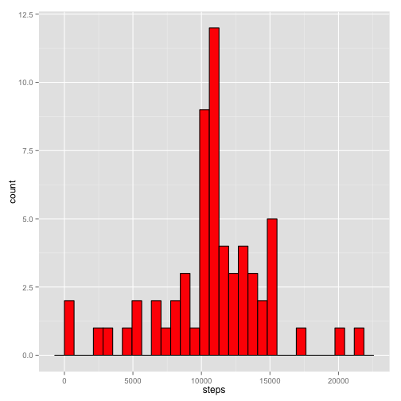

First, I would like to thank my fellow students for your time evaluating my document and I appreciate any feedback you have.

This assignment makes use of data collected by a personal monitoring device.

Each heading in the assignment will be completed in a chunk of R code

##Loading and preprocessing the data

```r
##First access data
        setwd("~/Dropbox/R Course Files/Reproducible Research")
        data1<-read.csv("activity.csv")

## Remove NAs
        data2<-data1[complete.cases(data1),]

## Convert dates
        library(lubridate)
        data2$date<-ymd(data2$date)
```

##What is the total number of steps taken per day?

```r
##Combine days, add up total steps
        temp1<- aggregate(steps ~ date, data2, sum)

## Plot histogram
        library(ggplot2)
        ggplot(temp1,aes(x=steps))+geom_histogram(fill="blue",color="black")+
        ggtitle("Total Number of Steps Taken Per Day")
```

```
## stat_bin: binwidth defaulted to range/30. Use 'binwidth = x' to adjust this.
```

 

```r
##Determine mean and medium steps each day
        calc1<-temp1$steps
        Avg1<-mean(calc1)
        Med1<-median(calc1)
        paste("The average number of steps per day is", Avg1)
```

```
## [1] "The average number of steps per day is 10766.1886792453"
```

```r
        paste("The median number of steps per day is", Med1)
```

```
## [1] "The median number of steps per day is 10765"
```

##What is the average daily activity pattern?

```r
## Combine intervals, determine average steps taken
        temp2<-aggregate (steps ~ interval, data2, mean)
        
## Plot average steps per interval as a time series        
        g2<-ggplot(temp2, aes(x=interval,y=steps))+geom_line()
        g2<-g2+ggtitle("Average Steps Per 5 Minute Interval")
        g2+xlab("Time Interval (h:mm)")+ylab("Average Number of Steps")
```

 

```r
## Determine interval with the maximum number of steps taken
        library(dplyr)
        temp3<-arrange(temp2, desc(steps))
        Max_Time<-numeric()
        Max_Time<-temp3[1,1]
        paste("The interval(h:mm) with the maximum steps taken is", Max_Time)
```

```
## [1] "The interval(h:mm) with the maximum steps taken is 835"
```

##Impute missing values

```r
 ## Determine the missing values in the original dataset
        missing_rows<-sum(is.na(data1))
        paste("The total number of rows with NA is",missing_rows)
```

```
## [1] "The total number of rows with NA is 2304"
```

```r
## Create new data set with imputed values
        Modded_Data<-data1
        Modded_Data$interval<-as.factor(Modded_Data$interval)
        library(plyr)
        impute.mean <- function(x) replace(x, is.na(x), mean(x, na.rm = TRUE))
Modded_Data<-ddply(Modded_Data, ~ interval, transform, steps = impute.mean(steps))
        Modded_Data2<-Modded_Data
        Modded_Data2$steps<-impute.mean(Modded_Data$steps)
        
 ## Determine total steps each day       
        Mod_temp1<- aggregate(steps ~ date, Modded_Data2, sum)
        
## Plot histogram
        library(ggplot2)
        ggplot(Mod_temp1,aes(x=steps))+geom_histogram(fill="red",color="black")
```

```
## stat_bin: binwidth defaulted to range/30. Use 'binwidth = x' to adjust this.
```

 

```r
##Determine mean and medium steps each day
        Mod_calc1<-Mod_temp1$steps
        Mod_Avg1<-mean(Mod_calc1)
        Mod_Med1<-median(Mod_calc1)
        
## Are their differences due to imputing?
        Diff_Avg<-Avg1-Mod_Avg1
        Diff_Med<-Med1-Mod_Med1
        paste("The difference between imputed and observed mean is", Diff_Avg)
```

```
## [1] "The difference between imputed and observed mean is 0"
```

```r
        paste("The difference between imputed and observed median is",Diff_Med)
```

```
## [1] "The difference between imputed and observed median is -1.1886792452824"
```

```r
        print("Thus there is no effect on mean but median is altered by imputing.")
```

```
## [1] "Thus there is no effect on mean but median is altered by imputing."
```

##Are there differences in activity patterns between weekdays and weekends?

```r
## Group data into weekdays or weekend
        Imp_Day<-as.Date(Modded_Data2$date)
        library(chron)
        Imp_Day2<-is.weekend(Imp_Day)
        Imp_Day2<-as.factor(Imp_Day2)
        levels(Imp_Day2)<-gsub("FALSE","weekday",levels(Imp_Day2))
        levels(Imp_Day2)<-gsub("TRUE","weekend",levels(Imp_Day2))
        Modded_Data2$Type_of_day<-Imp_Day2
        
## Combine intervals, determine average steps taken
       library(reshape2)
        Modded_Data2$date<-NULL
        md<-melt(Modded_Data2,id=(c("Type_of_day","interval")))
        md2<-dcast(md,Type_of_day+interval~variable,mean)
        md2$interval<-as.integer(md2$interval)
        
## Plot average steps per interval as a time series in a panel plot        
        g<-ggplot(md2, aes(x=interval,y=steps))+geom_line()
        g<-g+facet_grid(. ~ Type_of_day)
        g<-g+xlab("5 minute intervals")+ylab("Average number of steps")
        g+ggtitle("Comparison Of Weekday Versus Weekend Trends")
```

 

```r
        print("The imputed data suggest a difference in activity patterns")
```

```
## [1] "The imputed data suggest a difference in activity patterns"
```

